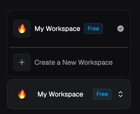
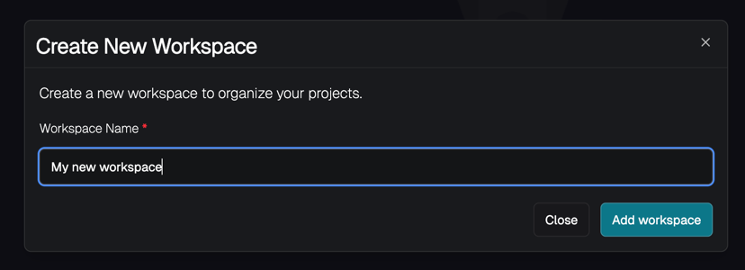
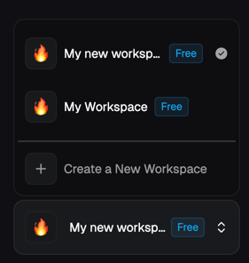

# Workspaces in Keyshade

## What are Workspaces?

A workspace is what holds all of your data—members, projects, secrets, integrations, etc. You can think of it as an organization, which ties up everything related to a business. You get a default workspace when you first register to keyshade.

A workspace allows you to do the following things:

- Create projects
- Add and manage secrets, variables and environments in these projects
- Create integrations that tie up your external services with keyshade
- Invite and manage members of your organization
- Implement RBAC via roles management
- Upgrade your workspace tier 
- Manage billing and subscription

A user can have an unlimited number of workspaces for free.

## Organizing your data

Each workspace is meant to hold data related to a single project, or organization. This means that projects related to a single application or organization should be container in a single workspace. 

## The default workspace

When you first register on Keyshade, you get a default workspace. This is where you land when you first log in. The default workspace is meant for personal use, hosting portfolio projects and such. We do not support any payments or subscriptions for the default workspace.

## Supported Functionalities

### Creating a workspace





- Head over to the dashboard at [app.keyshade.io](https://app.keyshade.io)
- Navigate to the bottom in the left sidebar and click on the combobox

  
- Click on **Create a New Workspace**
- Enter the name of the workspace 

  
- Click on **Add Workspace**
- And then, you can select your new workspace

  





- Create the workspace
    ```shell
    keyshade workspace create -n <workspace-name>
    ```
- Once done, you can verify that the workspace was created
    ```shell
    keyshade workspace list
    ```





### Updating a workspace





- From the sidebar, select the workspace that you want to edit
- Click on **Settings**
- Update the information and click on **Save Changes**





- To update the workspace name, run
    ```shell
    keyshade workspace update -n <workspace-name>
    ```




