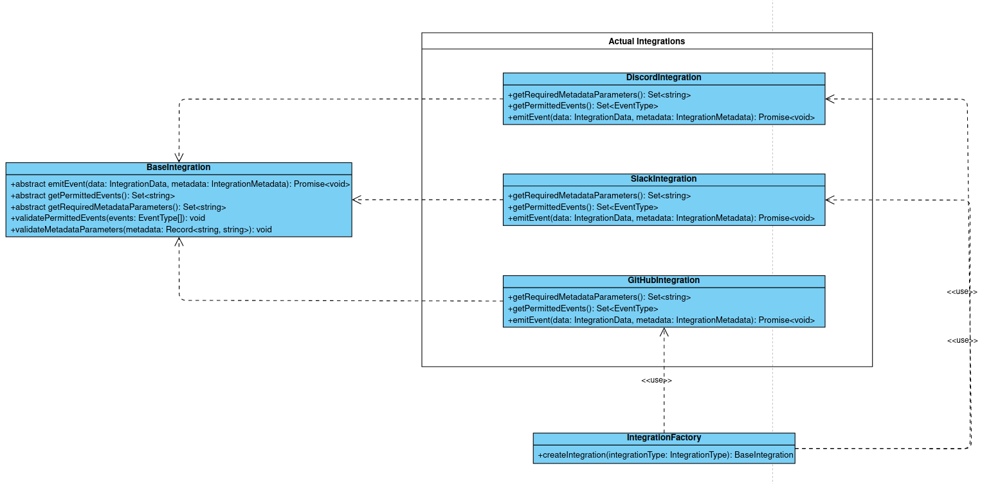

# Integrations

keyshade uses integrations to allow users tie up their existing infrastructure with our platform. This document covers how we have developed our integrations, allowing you to understand the architecture and develop your own integrations.

## Classification of integrations

keyshade broadly classifies integrations into two types:

- **Communication-oriented integrations**: These integrations are used to send notifications to the user. For example, sending a Discord notification to the user when a new project is created.

- **Infrastructure-oriented integrations**: These integrations are used to interact with the user's infrastructure. These are triggered whenever the value of a secret or a variable is changed. For example, updating the environment variables in the user's AWS Lambda function.

## Architecture

Our integrations are developed using the following class structure:

Our integrations follow the factory pattern for managing and delegating the integrations. The factory pattern allows us to create an instance of the integration based on the type of integration the user wants to use. The factory pattern is implemented in the `IntegrationFactory` class.

### The various classes

Here's a brief overview of the classes used in our integrations:

- **[IntegrationFactory](../../../apps/api/src/integration/plugins/factory/integration.factory.ts)**: This class is responsible for creating an instance of the integration based on the type of integration the user wants to use. You can find all various kinds of `integrationType`s from the [`IntegrationType` enum](../../../apps/api/src/prisma/schema.prisma#L161).

- **[BaseIntegration](../../../apps/api/src/integration/plugins/base.integration.ts)**: This is the base class for all integrations. It contains the common methods that all integrations should have. Note that two of the methods, `validatePermittedEvents` and `validatePermittedActions` are already implemented and are recommended against overriding. Rest of the three methods needs to be implemented by the child classes. Please refer to the code documentation to understand what each method does.

- **[IntegrationService](../../../apps/api/src/integration/service/integration.service.ts)**: This class is responsible for managing the integrations. It contains methods to create, update, delete, and fetch integrations. The factory method is called from within this class

### The types used

Apart from the classes, we also use a couple of types to manage the integrations. You can find these in [integration.types.ts](../../../apps/api/src/integration/integration.types.ts). The types are:

- **[IntegrationMetadata](../../../apps/api/src/integration/integration.types.ts#L38)**: The purpose of this interface is to ensure an uniform type for the data that will be stored in the integration's metadata. Ideally, every integration will be using a particular set of metadata that it will use to make API calls on behalf of keyshade. This interface is to be extended by every integration's metadata, and define the keys that the metadata will have. This will then be validated by the `validateMetadata` method in the `BaseIntegration` class.

- **[IntegrationEventData](../../../apps/api/src/integration/integration.types.ts#L17)**: This interface is used to define the data that will be passed to the integrations when an event is triggered.

## How the flow works

- An event occurs in keyshade
- The [createEvent](../../../apps/api/src/common/create-event.ts), which is called whenever an event occurs, tries to gather the integrations that are registered for this particular event. You can refer [this](../../../apps/api/src/common/create-event.ts#L77) to see how it does that.
- After all the registered integrations for this event are retrieved from the database, we run a for loop to create instances of the integrations and call the `emitEvent` method on them.
- The `emitEvent` function retrieves the authentication and other necessary integration details from the `metadata` parameter. It then crafts a request to the integration's API and sends the `data` parameter to the integration's API.

## Developing your own integrations

To develop your own integrations, you need to follow the following steps:

1. Create a new class that extends the `BaseIntegration` class. You can refer to the [BaseIntegration](../../../apps/api/src/integration/plugins/base.integration.ts) class to understand what methods you need to implement.

2. Implement the methods that you need to override in your child class. You can refer to the [BaseIntegration](../../../apps/api/src/integration/plugins/base.integration.ts) class to understand what each method does.

3. Create a new `IntegrationType` in the [IntegrationType enum](../../../apps/api/src/prisma/schema.prisma#L161) and add it to the enum.

4. Extend `IntegrationMetadata` interface in the [integration.types.ts](../../../apps/api/src/integration/integration.types.ts) file with your custom integration's metadata interface.

5. Add a case to the switch block in the `IntegrationFactory` class to return an instance of your integration when the `integrationType` is the one you created.

6. You are good to go!
