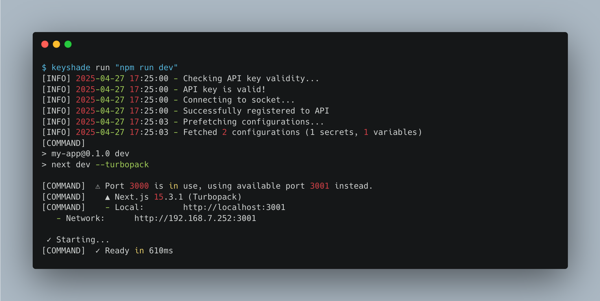

# Add keyshade to your project

We would be using a Next.js project to demonstrate the process. First, we will be setting up the project, then we would be using our CLI to tie up keyshade to the project.

## Creating a Next.js project

Create a NextJS app and name it `my-app`. Keep everything to default, and make sure that the app is using TypeScript.

Use this command to create a Next.js project:

```bash
npx create-next-app my-app
```

You can find more info about creating a Next.js project [here](https://nextjs.org/docs/app/api-reference/cli/create-next-app).

## Updating the `main.ts` file

In the `my-app` directory, open the `main.ts` file and add the following code:

```typescript
export default function Home() {
  return (
    <div className="bg-white h-screen w-screen text-center text-black flex flex-col">
      <div><span className="font-bold">Secret (NEXT_PUBLIC_API_KEY):</span> {process.env.NEXT_PUBLIC_API_KEY}</div>
      <div><span className="font-bold">Variable (NEXT_PUBLIC_PORT):</span> {process.env.NEXT_PUBLIC_PORT}</div>
    </div>
  );
}
```

As you can see, we are using 2 environment variables:

- `NEXT_PUBLIC_API_KEY`
- `NEXT_PUBLIC_PORT`

We have not added these in any `.env` file. If you recall, we added these to our project in the [Adding your first secret and variable](/docs/getting-started/adding-your-first-secret-and-variable) section.

## Initializing keyshade in your project

Run the following command to initialize keyshade in your project:

```bash
keyshade init
```

This is an interactive command, and will ask you to input the `workspace-slug`, `project-slug`, `environment-slug` and `private-key` to create the `keyshade.json` file in your project root directory.

You could alternatively run this command to add everything in one line:

```bash
keyshade init --workspace-slug my-workspace --project-slug my-project --environment-slug my-environment --private-key my-private-key
```

You would notice that the `keyshade.json` file has been created in your project root directory. The content would look something like this:

```json
{
  "workspace": "my-workspace-0",
  "project": "my-app-0",
  "environment": "dev-0",
  "quitOnDecryptionFailure": false
}
```

Your project's private key has been added into `~/.keyshade/private-keys.json`. This approach makes it impossible for you to mistakenly commit your private key to your repository.

## Running your app

Generally we run NextJS apps using the `npm run dev` command. But to make keyshade work, we will need to run it using this command:

```bash
keyshade run "npm run dev"
```

Once you run this, you would see the following output:


As you can see, there are some additional logs stating that keyshade was succssfully set up.

You can also see the following line:

```bash
[INFO] 2025-04-27 17:25:03 - Fetched 2 configurations (1 secrets, 1 variables)
```

This states that keyshade was able to fetch 2 configurations - 1 secret and 1 variable.

## Seeing the results

We have successfully added keyshade to our project. Now, let's see the results.

Head over to http://localhost:3000 and you should see the following:


The app has fetched the secret and variable from keyshade and injected them into the app.

That's it! You have successfully added keyshade to your project.
