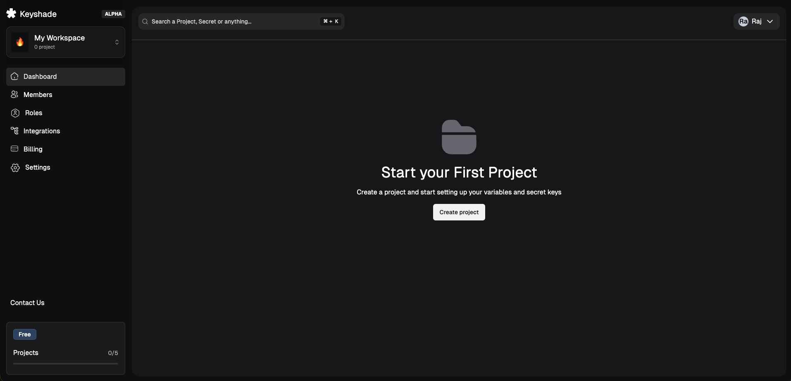
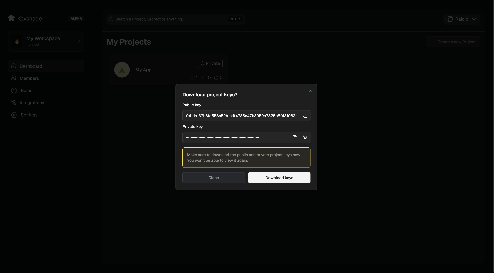
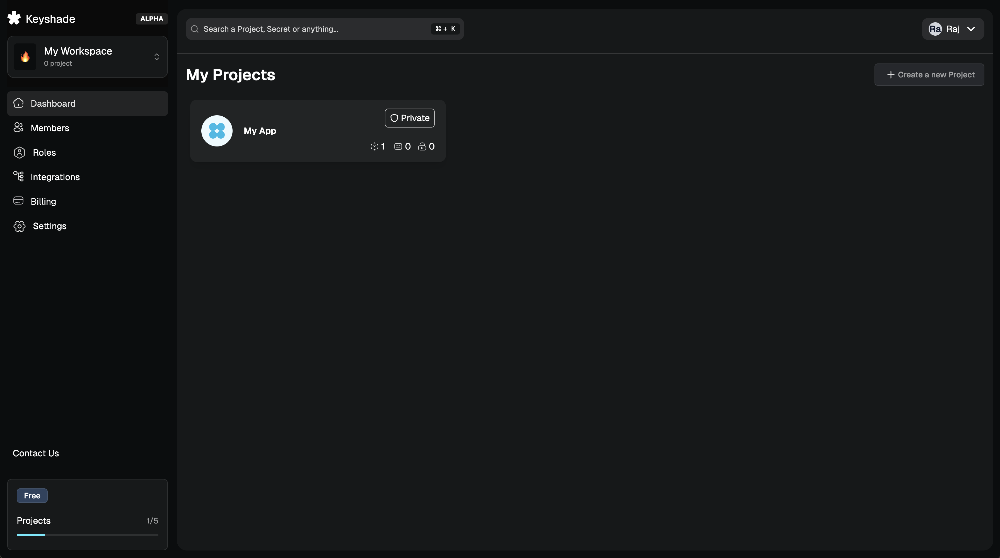
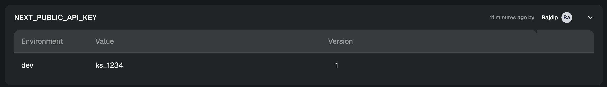
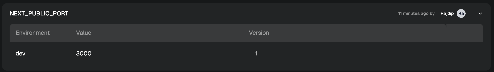

# Introduction

Our app is the place where you manage all of your secrets and variables. This can also be done using the CLI, but we want to keep it as simple as possible for now. Here's a list of things that we will be doing in this tutorial:

- Creating a new project
- Creating a secret in your project
- Creating a variable in your project

So, let's get started!

## Creating a new project

Head over to https://app.keyshade.xyz. This is where you get to access our platform. Log in with your email, or your favourite OAuth provider. Once inside, you should be greeted with a similar page like this:

Now, we can start creating our project.

- Click on **Create Project**
- Enter your project name
- Store the private key in the project **(not recommended in production projects)**
- Edit or add environments if your want to
- Finally, click on **Create Project**

If the creation was successful, you should be greeted with a dialog like this:  You can hit on **Close** for now.

Your project should now show up in your dashboard:

## Creating a secret

Now, let's create our first secret.

- Select the newly created **My App** project.
- Head over to the **Secrets** tab.
- Enter the name of the secret. We will use `NEXT_PUBLIC_API_KEY`. You can also add a note if you want to.
- Specify a value for the `dev` environment we created. We would use `ks_1234`.
- Hit on **Add Secret**.

If created successfully, you secret should look like this: 

## Creating a variable

Lastly, let's create our first variable.

- Head over to the **Variables** tab.
- Enter the name of the variable. We will use `NEXT_PUBLIC_PORT`. You can also add a note if you want to.
- Specify a value for the `dev` environment we created. We would use `3000`.
- Hit on **Add Variable**.

If created successfully, you variable should look like this: 

## That's it!

We are now in a pretty good shape. We have added our first secret and variable. Now, lets get the CLI installed and set up locally.
