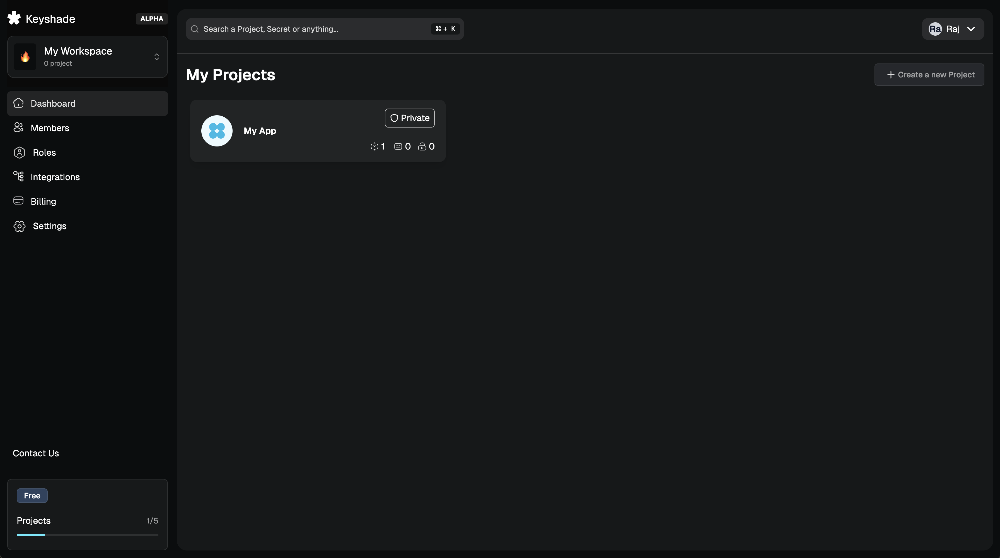

# Creating a project

You would need to create a project to start importing your environment variables to keyshade. 

## Creating a new project

Head over to [https://app.keyshade.io](https://app.keyshade.io). This is where you get to access our platform. Log in with your email, or your favourite OAuth provider. Once inside, you should be greeted with a similar page like this:

Now, we can start creating our project.

- Click on **Create Project**
- Enter your project name
- Optionally, you can store the private key in the project **(not recommended in production projects)**
- Edit or add environments if you want to
- Finally, click on **Create Project**

> 💡 **Want to learn more about environments?** Check out our comprehensive [Environments documentation](../../internals/environments.md) to understand what environments are, how they work, and all the functionalities available for managing them.

If the creation was successful, you should be greeted with a dialog like this:

 

You can download the private and public key then hit on **Close**.

Your project should now show up in your dashboard:

