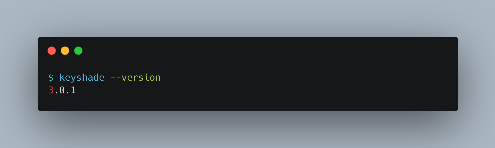

# Installing the CLI

The Keyshade CLI servers as the entrypoint for your projects and apps to use keyshade. Currently, our CLI binary is hosted over npm registry, and it can be installed by running the following command:

```sh
npm i -g @keyshade/cli
```

That's it! You now have keyshade installed on your system.

To verify the installation, you can run the following command:

```sh
keyshade --version
```

This should print the version of the Keyshade CLI that you have installed.
 At the time of creating this blog, the latest version of the CLI is `3.0.1`

> **Note:** If you would like to opt in for beta testing, we also maintain a separate version of the CLI. You can install that using `npm i -g @keyshade/cli@stage`
