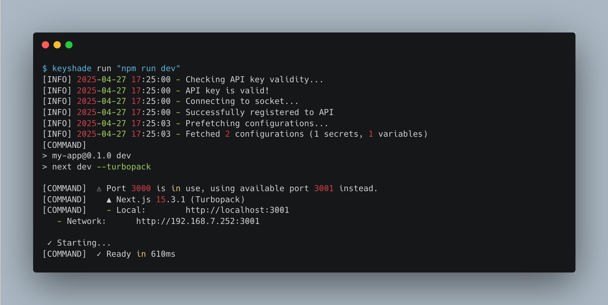

# Running your app

In te previous section, we added keyshade to our project. Now, let's run our app.

Generally we run NextJS apps using the `npm run dev` command. But to make keyshade work, we will need to run it using this command:

```bash
keyshade run "npm run dev"
```

> **Note:** In case you have used something else in place of NextJS, use the same command to run your app. For example, if you have used a simple NodeJS app, you could use `keyshade run "node index.js"`

Once you run this, you would see the following output:



As you can see, there are some additional logs stating that keyshade was successfully set up.

You can also see the following line:

```bash
[INFO] 2025-04-27 17:25:03 - Fetched 2 configurations (1 secrets, 1 variables)
```

This states that keyshade was able to fetch 2 configurations - 1 secret and 1 variable.

## Seeing the results

We have successfully added keyshade to our project. Now, let's see the results.

Head over to http://localhost:3000 and you should see the following:


The app has fetched the secret and variable from keyshade and injected them into the app.

That's it! You have successfully added keyshade to your project.
