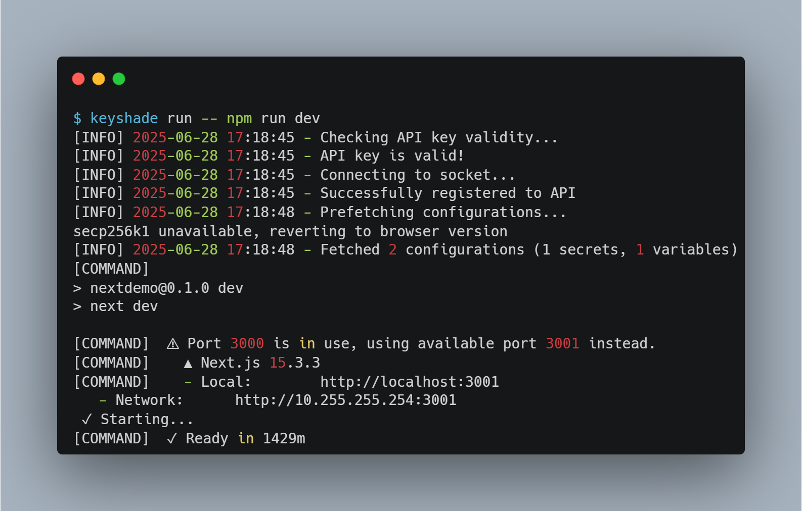

# Running your app

Finally, to utilize your environment variables from keyshade in your local project, use this command:
```shell
keyshade run -- <your command>
```

Say you have a NextJS app, you would be using:
```shell
keyshade run -- npm run dev
```



The app has fetched the secret and variable from Keyshade and injected them into the app.

That's it! You have successfully added Keyshade to your project.
