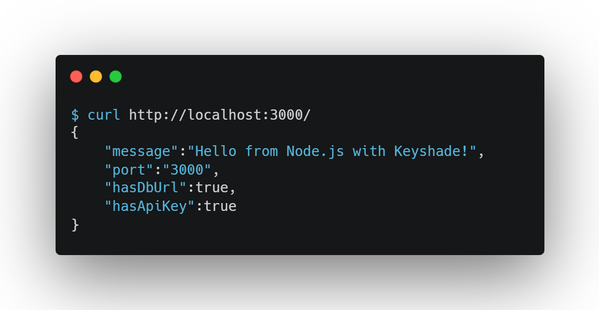

# Set up Keyshade with Node.js

**Keyshade** securely manages your environment variables and secrets — no more `.env` files, and nothing sensitive committed to your repo.

This guide will walk you through setting up Keyshade in a Node.js app, step by step.

> Prefer to dive straight into code? Jump to [Running Your App](#run-your-app-with-secure-env-injection)

## Coming Up

Here's what this guide covers:

-   Create a Node.js app
-   [Install the Keyshade CLI](/docs/getting-started/installing-the-cli.md)
-   [Set up a profile](/docs/getting-started/setting-up-your-profile.md) using your API key
-   Create a project and environment in the Keyshade dashboard
-   [Add secrets and runtime variables](/docs/getting-started/adding-your-first-secret-and-variable.md)
-   Link your local project with `keyshade init`
-   Run your app with `keyshade run`
-   Use `process.env` to access values in your Node.js code

> 💡 New to Keyshade? Start with [What is Keyshade?](/docs/getting-started/introduction.md) to get a quick overview of how it works.

## Create a Node.js Project

If you don't already have a Node.js app, create one:

```bash
mkdir <your-app-name>
cd <your-app-name>
npm init -y
```

For TypeScript projects, add the necessary dependencies:

```bash
npm install --save-dev typescript @types/node ts-node
npx tsc --init
```

> Need more help with Node.js project setup? [Check out the official Node.js documentation](https://nodejs.org/en/learn/getting-started/introduction-to-nodejs).

## Install the Keyshade CLI

The Keyshade CLI lets you fetch secrets, inject env variables, and manage profiles all from your terminal.

Install it globally:

```bash
npm install -g @keyshade/cli
```

**Note:** Node.js v24 may cause issues with the Keyshade CLI, so use v20 (LTS) for best compatibility.

> See [Installing the CLI](/docs/getting-started/installing-the-cli.md) for more info.

## Set Up Your Profile

To connect your local environment with Keyshade, create or use a profile.

If this is your **first time using Keyshade**, follow [this guide to set up your profile](/docs/getting-started/setting-up-your-profile.md).

If you've already used Keyshade before:

```bash
keyshade profile use <your-profile-name>
```

You can verify which profile is active with:

```bash
keyshade workspace list
```

## Create a Project and Add Secrets

To get started:

1.  Go to the [Keyshade Dashboard](https://app.keyshade.xyz/)
2.  Click **"Create Project"**
3.  Name your project (e.g. `nodejs-app`)
4.  Inside the project, click the **"Secrets"** tab
5.  Add your **secrets**:
6.  Add your **variables**:

> 💡 **Secrets vs Variables:**
>
> -   **Secrets** are sensitive values — like API keys or access tokens — and are encrypted for security.
>     
> -   **Variables** are non-sensitive settings — like ports, feature flags, or toggles — and are stored as plain values, not encrypted.
 
> Need help with projects and secrets? See [Managing Secrets & Variables](https://claude.ai/docs/getting-started/adding-your-first-secret-and-variable.md)

## Initialize Keyshade in Your Project

From your project root:

```bash
cd <your-app-name>
```

Run the init command to link your local project with the Keyshade dashboard:

```bash
keyshade init
```

You'll be guided through selecting your workspace, project, and environment.

Want to skip the prompts?

```bash
keyshade init --workspace-slug <my-workspace> --project-slug <my-project> --environment-slug <my-environment> --private-key <my-private-key>
```

This will generate a `keyshade.json` file in your project root.

> More on this in the [CLI Reference](https://claude.ai/docs/getting-started/installing-the-cli.md)

## Run Your App with Secure Env Injection

Start your Node.js app with Keyshade:

For JavaScript:

```bash
keyshade run -- node index.js
```

For TypeScript:

```bash
keyshade run -- ts-node index.ts
```

Or if you have npm scripts defined in `package.json`:

```bash
keyshade run -- npm start
```

Example output:


Keyshade will inject your secrets and variables securely at runtime.

## Access Secrets and Variables in Your Code

Once your app is running with `keyshade run`, use `process.env` to access any injected values — no extra setup needed.

For example, if you added a secret named `DATABASE_URL` and a variable named `PORT` in the Keyshade dashboard:

In JavaScript:

```javascript
// JavaScript
const dbUrl = process.env.DATABASE_URL;
const port = process.env.PORT || 3000;
```

In TypeScript:

```typescript
// TypeScript  
const dbUrl: string | undefined = process.env.DATABASE_URL;
const port: number = parseInt(process.env.PORT || '3000');
```

### Example Node.js Server

Create a simple Express server in `index.js`:


Now run it with `keyshade run -- node index.js` and you'll see your server start with all secrets securely injected.

Visit `http://localhost:3000` to confirm your secrets are being injected properly. See below for reference:




**You're All Set 🚀**

_Your Node.js app is now securely powered by Keyshade — no `.env` files, no leaking secrets, and no environment mismatches._