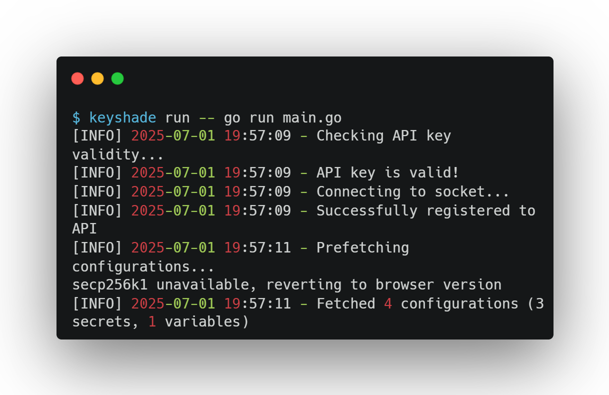
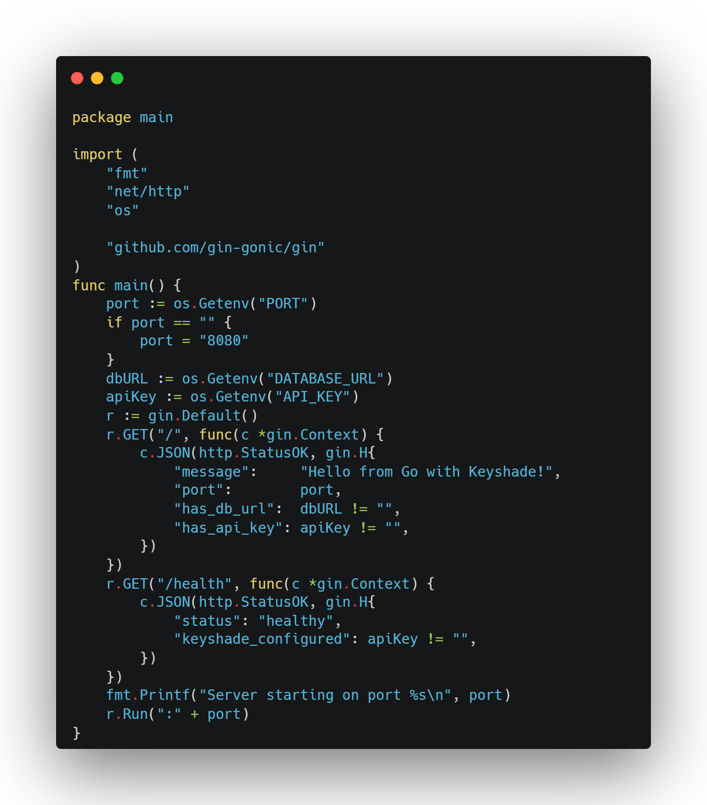
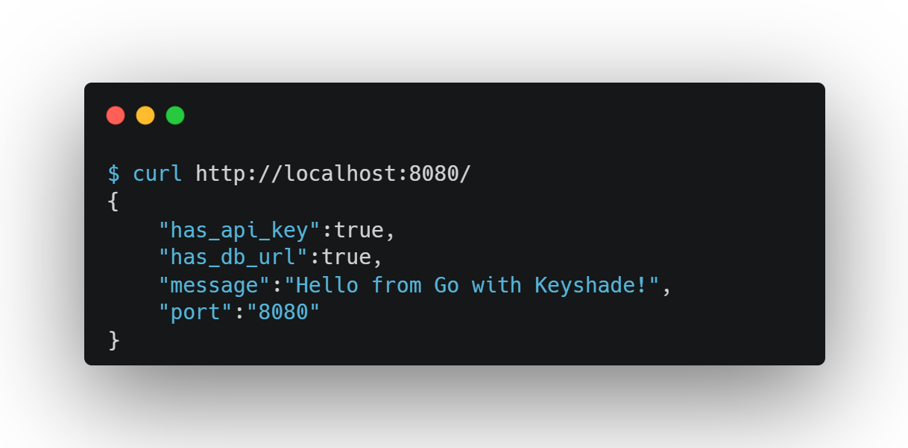

# Set up Keyshade with Go

**Keyshade** is a drop-in replacement for `.env` files that securely manages your secrets and environment variables. No more accidentally committing your API keys and waking up to unexpected cloud bills.

This guide walks you through integrating Keyshade into your Go application, step by step. Don’t worry, it’s easier than naming your variables without triggering `golint`.

> Prefer to dive straight into code? Jump to [Running Your App](#run-your-app-with-secure-env-injection)

## Coming Up

Here's what this guide covers:

- Create a Go app  
- [Install the Keyshade CLI](/docs/getting-started/installing-the-cli.md)  
- [Set up a profile](/docs/getting-started/setting-up-your-profile.md) using your API key  
- Create a project and environment in the Keyshade dashboard
- [Add secrets and runtime variables](/docs/getting-started/adding-your-first-secret-and-variable.md)   
- Link your local project with `keyshade init`  
- Run your app with `keyshade run`  
- Use `os.Getenv` to access values in your Go code

> 💡 If you're not familiar with how Keyshade works, we recommend starting with [What is Keyshade?](/docs/getting-started/introduction.md)

## Create a Go Project

If you don't already have a Go app, create one with Go modules:

```bash
mkdir <your-app-name>
cd <your-app-name>
go mod init <your-module-name>
```

This creates a `go.mod` file for dependency management.

For web applications, you might want to add common dependencies:

```bash
go get github.com/gin-gonic/gin
go get github.com/gorilla/mux
```

> Need more help with Go project setup? [Check out the official Go documentation](https://golang.org/doc/tutorial/create-module).

## Install the Keyshade CLI

The Keyshade CLI lets you fetch secrets, inject env variables, and manage profiles all from your terminal.

Install it globally:

```bash
npm install -g @keyshade/cli
```

**Note:** Node.js v24 may cause issues with the Keyshade CLI, so use v20 (LTS) for best compatibility.

> See [Installing the CLI](/docs/getting-started/installing-the-cli.md) for more info.

## Set Up Your Profile

To connect your local environment with Keyshade, create or use a profile.

If this is your **first time using Keyshade**, follow [this guide to set up your profile](/docs/getting-started/setting-up-your-profile.md).

If you've already used Keyshade before:

```bash
keyshade profile use <your-profile-name>
```
You can verify which profile is active with:
```bash
keyshade workspace list
```

## Create a Project and Add Secrets

To get started:
1.  Go to the [Keyshade Dashboard](https://app.keyshade.xyz/)
2.  Click **"Create Project"**
3.  Name your project (e.g. `go-app`)
4.  Inside the project, click the **"Secrets"** tab
5.  Add your **secrets** (e.g. `DATABASE_URL`) 
6.  Add your **variables** (e.g. `PORT`)

> 💡 **Secrets vs Variables:**
>
>* **Secrets** are sensitive credentials like API keys or tokens. These are encrypted.
>
>* **Variables** are non-sensitive configs like ports, flags, or feature toggles. These are stored as-is and are not encrypted.

> Need help with projects and secrets? See [Managing Secrets & Variables](/docs/getting-started/adding-your-first-secret-and-variable.md)

## Initialize Keyshade in Your Project

In order to use the configurations you just created on the dashboard, you would need to initialize keyshade in your project. This generates the necessary configurations for the CLI to tap into your keyshade project.

From your project root:

```bash
cd <your-app-name>
```
Run the init command to link your local project with the Keyshade dashboard:

```bash
keyshade init
```

You'll be guided through selecting your workspace, project, and environment.

Want to skip the prompts?

```bash
keyshade init --workspace-slug <my-workspace> --project-slug <my-project> --environment-slug <my-environment> --private-key <my-private-key>
```
This will generate a `keyshade.json` file in your project root.

> More on this in the [CLI Reference](/docs/getting-started/installing-the-cli.md)

## Run Your App with Secure Env Injection

Start your Go app with Keyshade:

```bash
keyshade run -- go run main.go
```

For building and running:
```bash
keyshade run -- go build -o myapp && ./myapp
```

For specific packages:
```bash
keyshade run -- go run ./cmd/server
```

For example:



Keyshade will inject your secrets and variables securely at runtime.

## Access Secrets and Variables in Your Code

Once your app is running with `keyshade run`, use `os.Getenv` to access any injected values — no extra setup needed.

For example, if you added a secret named `DATABASE_URL` and a variable named `PORT` in the Keyshade dashboard:

```go
dbURL := os.Getenv("DATABASE_URL")
portStr := os.Getenv("PORT")
```

### Example HTTP Server with Gin

Create a web server in `main.go`:



Make sure the Gin dependency to your project:

```bash
go get github.com/gin-gonic/gin
```

Use `keyshade run -- go run main.go` to start your server with all secrets securely injected.

Visit `http://localhost:8080` to confirm your secrets are being loaded properly.



**You're All Set 💃**

_Your Go app is now securely powered by Keyshade — no `.env` files, no leaking secrets, and no environment mismatches._