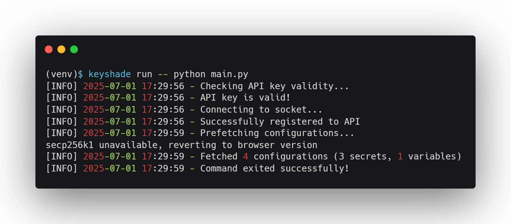
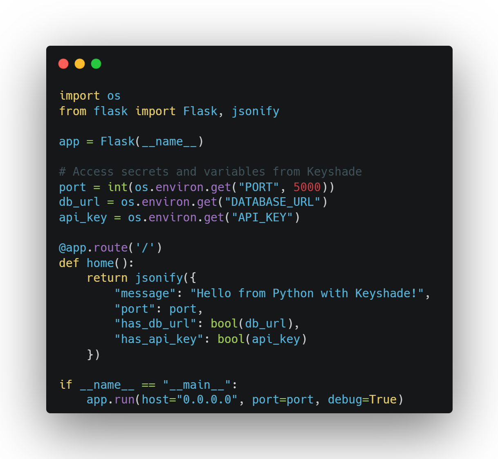
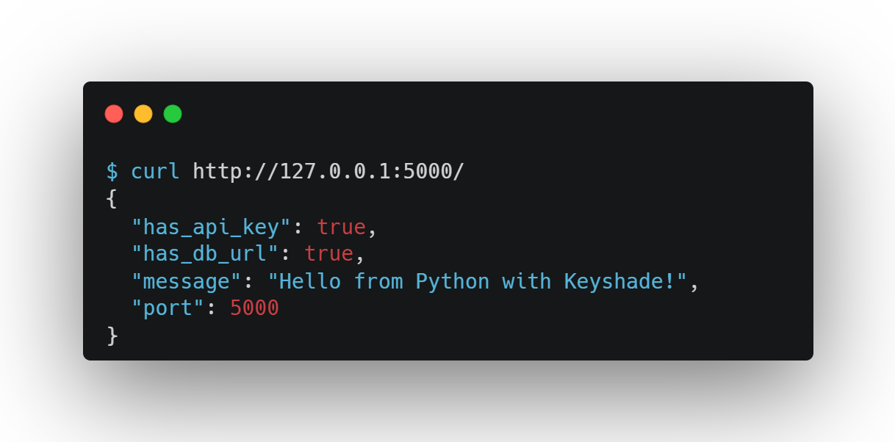

# Set up Keyshade with Python

**Keyshade** is a secure, runtime alternative to `.env` files — it keeps your secrets and environment variables safe, without ever needing to commit them to your repo.

This guide walks you through integrating Keyshade into your Python app, step by step — no `import os` gymnastics required.

> Prefer to dive straight into code? Jump to [Running Your App](#run-your-app-with-secure-env-injection)

## Coming Up

Here's what this guide covers:

- Create a Python app  
- [Install the Keyshade CLI](/docs/getting-started/installing-the-cli.md)  
- [Set up a profile](/docs/getting-started/setting-up-your-profile.md) using your API key  
- Create a project and environment in the Keyshade dashboard  
- [Add secrets and runtime variables](/docs/getting-started/adding-your-first-secret-and-variable.md)   
- Link your local project with `keyshade init`  
- Run your app with `keyshade run`  
- Use `os.environ` to access values in your Python code

> 💡 First time using Keyshade? We recommend starting with [What is Keyshade?](/docs/getting-started/introduction.md) to get familiar with how it works.

## Create a Python Project

If you don't already have a Python app, create one with a virtual environment:

```bash
mkdir <your-app-name>
cd <your-app-name>
python -m venv venv
source venv/bin/activate # On Windows: venv\Scripts\activate
```

> See the [official Python documentation on venv](https://docs.python.org/3/library/venv.html#how-venv-works) for more details.

## Install the Keyshade CLI

The Keyshade CLI lets you fetch secrets, inject env variables, and manage profiles all from your terminal.

Install it globally:

```bash
npm install -g @keyshade/cli
```

**Note:** Node.js v24 may cause issues with the Keyshade CLI, so use v20 (LTS) for best compatibility.

> See [Installing the CLI](/docs/getting-started/installing-the-cli.md) for more info.

## Set Up Your Profile

To connect your local environment with Keyshade, create or use a profile.

If this is your **first time using Keyshade**, follow [this guide to set up your profile](/docs/getting-started/setting-up-your-profile.md).

If you've already used Keyshade before:

```bash
keyshade profile use <your-profile-name>
```
You can verify which profile is active with:
```bash
keyshade workspace list
```

## Create a Project and Add Secrets

To get started:
1.  Go to the [Keyshade Dashboard](https://app.keyshade.xyz/)
2.  Click **"Create Project"**
3.  Name your project (e.g. `python-app`)
4.  Inside the project, click the **"Secrets"** tab
5.  Add your **secrets** (e.g. `API_KEY`, `DATABASE_URL`)
6.  Add your **variables** (e.g. `PORT`)

> 💡 **Secrets vs Variables:**
>
>* **Secrets** are sensitive credentials, such as API keys or access tokens. These are securely encrypted by Keyshade to keep them protected.
>
>* **Variables** are non-sensitive configuration values, like port numbers, feature flags, or environment modes. These are stored in plain text and are not encrypted.

> Need help with projects and secrets? See [Managing Secrets & Variables](/docs/getting-started/adding-your-first-secret-and-variable.md)

## Initialize Keyshade in Your Project

In order to use the configurations you just created on the dashboard, you would need to initialize keyshade in your project. This generates the necessary configurations for the CLI to tap into your keyshade project.

From your project root:

```bash
cd <your-app-name>
```
Run the init command to link your local project with the Keyshade dashboard:

```bash
keyshade init
```

You'll be guided through selecting your workspace, project, and environment.

Want to skip the prompts?

```bash
keyshade init --workspace-slug <my-workspace> --project-slug <my-project> --environment-slug <my-environment> --private-key <my-private-key>
```
This will generate a `keyshade.json` file in your project root.

> More on this in the [CLI Reference](/docs/getting-started/installing-the-cli.md)

## Run Your App with Secure Env Injection

Start your Python app with Keyshade:

For a simple Python script:
```bash
keyshade run -- python main.py
```

For web frameworks:
```bash
keyshade run -- flask run
keyshade run -- uvicorn app:app --reload
keyshade run -- python manage.py runserver
```

Example Output:



Keyshade will inject your secrets and variables securely at runtime.

## Access Secrets and Variables in Your Code

Once your app is running with `keyshade run`, use `os.environ` to access any injected values — no extra setup needed.

For example, if you added secrets named `DATABASE_URL` and `API_KEY`, and a variable named `PORT` in the Keyshade dashboard:

```python
db_url = os.environ.get("DATABASE_URL")
port = int(os.environ.get("PORT", 5000))
api_key = os.environ.get("API_KEY")
```

### Example Flask Application

Create a simple Flask app in `app.py`:



Now use `keyshade run -- python app.py` to start your Flask server with all secrets securely injected.

Visit `http://localhost:5000` to confirm your secrets are being loaded properly.




**You're All Set 🎊**

_Your Python app is now securely powered by Keyshade — no `.env` files, no leaking secrets, and no environment mismatches._