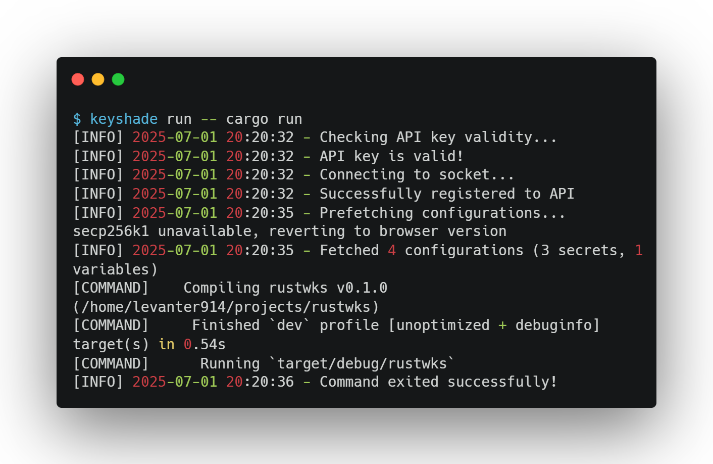
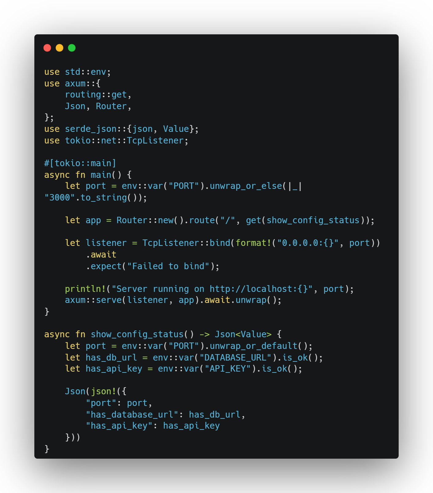

# Set up Keyshade with Rust

**Keyshade** is a secure, runtime alternative to `.env` files — it lets you manage secrets and environment variables safely, without committing anything sensitive to your repo.

This guide walks you through adding Keyshade to your Rust app, step by step — no need to `unwrap()` your secrets from `.env` ever again.

> Prefer to dive straight into code? Jump to [Running Your App](#run-your-app-with-secure-env-injection)

## Coming Up

Here's what this guide covers:

- Create a Rust app  
- [Install the Keyshade CLI](/docs/getting-started/installing-the-cli.md)  
- [Set up a profile](/docs/getting-started/setting-up-your-profile.md) using your API key  
- Create a project and environment in the Keyshade dashboard  
- [Add secrets and runtime variables](/docs/getting-started/adding-your-first-secret-and-variable.md)   
- Link your local project with `keyshade init`  
- Run your app with `keyshade run`  
- Use `std::env` to access values in your Rust code

> 💡 If you're not familiar with how Keyshade works, we recommend starting with [What is Keyshade?](/docs/getting-started/introduction.md)

## Create a Rust Project

If you don't already have a Rust app, create one using Cargo:

```bash
cargo new <your-app-name>
cd <your-app-name>
```

This creates a `Cargo.toml` file and a `src/main.rs` file for your new project.

For web applications, you might want to add common dependencies. For example:

```toml
[dependencies]
tokio = { version = "1", features = ["full"] }
serde = { version = "1.0", features = ["derive"] }
```

> Need more help with Rust project setup? [Check out the official Rust documentation](https://doc.rust-lang.org/cargo/guide/creating-a-new-project.html).

## Install the Keyshade CLI

The Keyshade CLI lets you fetch secrets, inject env variables, and manage profiles all from your terminal.

Install it globally:

```bash
npm install -g @keyshade/cli
```

**Note:** Node.js v24 may cause issues with the Keyshade CLI, so use v20 (LTS) for best compatibility.

> See [Installing the CLI](/docs/getting-started/installing-the-cli.md) for more info.

## Set Up Your Profile

To connect your local environment with Keyshade, create or use a profile.

If this is your **first time using Keyshade**, follow [this guide to set up your profile](/docs/getting-started/setting-up-your-profile.md).

If you've already used Keyshade before:

```bash
keyshade profile use <your-profile-name>
```
You can verify which profile is active with:
```bash
keyshade workspace list
```

## Create a Project and Add Secrets

To get started:
1.  Go to the [Keyshade Dashboard](https://app.keyshade.xyz/)
2.  Click **"Create Project"**
3.  Name your project
4.  Inside the project, click the **"Secrets"** tab
5.  Add your **secrets** (e.g. `DATABASE_URL`, `API_KEY`) 
6.  Add your **variables** (e.g. `PORT`)

> 💡 **Secrets vs Variables:**
>
>* **Secrets** are sensitive credentials like API keys or tokens. These are encrypted.
>
>* **Variables** are non-sensitive configs like ports, flags, or feature toggles. These are stored as-is and are not encrypted.

> Need help with projects and secrets? See [Managing Secrets & Variables](/docs/getting-started/adding-your-first-secret-and-variable.md)

## Initialize Keyshade in Your Project

In order to use the configurations you just created on the dashboard, you would need to initialize keyshade in your project. This generates the necessary configurations for the CLI to tap into your keyshade project.

From your project root:

```bash
cd <your-app-name>
```
Run the init command to link your local project with the Keyshade dashboard:

```bash
keyshade init
```

You'll be guided through selecting your workspace, project, and environment.

Want to skip the prompts?

```bash
keyshade init --workspace-slug <my-workspace> --project-slug <my-project> --environment-slug <my-environment> --private-key <my-private-key>
```
This will generate a `keyshade.json` file in your project root.

> More on this in the [CLI Reference](/docs/getting-started/installing-the-cli.md)

## Run Your App with Secure Env Injection

Start your Rust app with Keyshade:

```bash
keyshade run -- cargo run
```

For release builds:
```bash
keyshade run -- cargo run --release
```

For specific binaries:
```bash
keyshade run -- cargo run --bin my-server
```

Example Output:



Keyshade will inject your secrets and variables securely at runtime.

## Access Secrets and Variables in Your Code

Once your app is running with `keyshade run`, use `std::env` to access any injected values — no extra setup needed.

For example, if you added secrets named `DATABASE_URL` and `API_KEY`, and a variable named `PORT` in the Keyshade dashboard:

```bash
let database_url = env::var("DATABASE_URL").expect("DATABASE_URL must be set");
let api_key = env::var("API_KEY").expect("API_KEY must be set");
let port = env::var("PORT").unwrap_or_else(|_| "8000".to_string());
```

### Example web server in `src/main.rs`:



Make sure to add these dependencies to your `Cargo.toml`:

```toml
[dependencies]
axum = "0.7"
tokio = { version = "1", features = ["full"] }
serde_json = "1.0"
```

Use `keyshade run -- cargo run` to start your server with all secrets securely injected.

Visit `http://localhost:3000` to confirm your secrets are being loaded properly.


**You're All Set 🥳**

_Your Rust app is now securely powered by Keyshade — no `.env` files, no leaking secrets, and no environment mismatches._